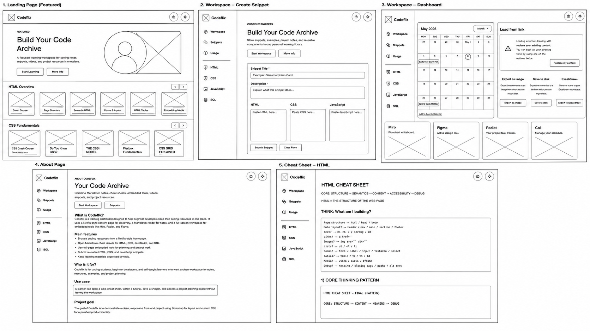

# Codeflix Coding Workspace

Codeflix is a simple, organised, streaming-style coding learning website. It is designed to help users browse coding topics, read notes, review snippets, watch learning videos, and access useful coding tools in one clear place.

The goal of the project is to make coding information easier to store, organise, revisit, and reuse over time.

## Live Project

- Live site: `ADD YOUR DEPLOYED SITE LINK HERE`
- Repository: `ADD YOUR GITHUB REPOSITORY LINK HERE`

## Project Purpose

Codeflix provides a visual workspace for learning and reviewing coding content. The site focuses on clear navigation, readable layouts, reusable content, and a clean streaming-style interface.

Users can use the site to:

- Browse coding topics
- Read Markdown learning notes
- Watch selected coding videos
- View and submit reusable code snippets
- Access useful learning resources
- Use embedded workspace tools
- Revisit coding content later

## Target Audience

This project is aimed at:

- Coding students
- Beginner developers
- People learning HTML, CSS, JavaScript, or SQL
- Self-taught learners
- Anyone who wants a simple place to organise coding notes and resources

## User Value

Codeflix helps learners avoid scattering notes, links, snippets, and project tools across different places. It brings learning content into one structured interface so users can quickly find resources, review topics, and continue working without losing context.

## Features

- Streaming-style home page with topic rows
- Sidebar navigation for key learning sections
- Quick tool rail with prompt buttons and ChatGPT popup link
- Markdown content viewer
- Saved note support for Markdown topics using local storage
- Snippet submission form
- Workspace dashboard with embedded tools
- Widget size controls on the workspace page
- Video cards that load selected videos into the hero player
- Prompt copy buttons with copied feedback
- Auto-hide footer interaction
- Responsive layout for desktop, tablet, and mobile
- Accessible labels, alt text, iframe titles, and keyboard-friendly controls

## Website Pages



>More information: [id-class-map.xlsx]([URL](https://docs.google.com/spreadsheets/d/1fyj7uiPlhO1ztOMTVsF7pcj02F0SGqsQvYQtRaFk6x0/edit?gid=0#gid=0))

### Home Page

File: `index.html`

The home page introduces the Codeflix platform and includes:

- A platform overview
- Featured coding topics
- Content rows
- Video lesson cards
- Hero video player
- Popular skills section
- Fixed navigation
- Learning sections

### Usage Page

File: `usage.html`

The usage page explains:

- The purpose of Codeflix
- How the website helps users learn
- How users can browse and reuse coding content
- Who the website is designed for

### Snippets Page

File: `snippets.html`

The snippets page provides a form for submitting reusable snippets.

It includes fields for:

- Snippet title
- Snippet description
- HTML code
- CSS code
- JavaScript code

### Content Page

File: `content.html`

The content page is used to display organised learning content from Markdown files.

It supports:

- Loading content from URL file parameters
- Markdown rendering
- Topic-specific saved notes
- Sidebar topic navigation

### Workspace Page

File: `workspace.html`

The workspace page provides a dashboard-style area for embedded learning and planning tools.

Example tools include:

- Google Calendar
- Excalidraw
- Miro
- Figma
- Padlet
- Cal.com
- JSFiddle
- Ophir whiteboard

## Content Files

Learning content is stored using Markdown files inside the `content` folder.

The intended content pattern is:

```text
content/
├── html/
│   └── 01-getting-started/
│       ├── html-cheat-sheet.md
│       └── resources.md
├── css/
│   └── 01-getting-started/
│       ├── css-cheat-sheet.md
│       └── resources.md
├── javascript/
│   └── 01-getting-started/
│       ├── js-cheat-sheet.md
│       └── resources.md
├── sql/
│   └── 01-getting-started/
│       ├── sql-cheat-sheet.md
│       └── resources.md
└── workspace/
    └── tool-space.md
```

---

# Lighthouse Performance Review

## Overview

Codeflix was reviewed and optimised using Google Lighthouse to improve:

- Performance
- Accessibility
- Best Practices
- SEO

The optimisation process focused on improving loading efficiency and runtime performance while preserving the existing architecture, layout system, responsive behaviour, and user experience.

---

## Final Lighthouse Scores

| Page | Performance | Accessibility | Best Practices | SEO |
|---|---|---|---|---|
| Homepage (`index.html`) | 96 | 100 | 96 | 91 |
| Workspace (`workspace.html`) | 92 | 100 | 96 | 100 |
| Snippets (`snippets.html`) | 97 | 100 | 96 | 90 |

---

# Optimisation Goals

The main goal was to improve Lighthouse performance WITHOUT causing architectural drift.

This meant preserving:

- existing UI and layout
- DOM structure
- responsive behaviour
- iframe functionality
- JavaScript interaction flow
- accessibility behaviour
- navigation structure
- Bootstrap layout system
- dataset-driven interaction patterns

---

## Safe Performance Optimisations Applied

## Lazy Loading

Added native lazy loading for:

- YouTube thumbnails
- inactive iframes
- embedded media

Example:

```html

<iframe loading="lazy"></iframe>

## AI Reflection

AI was used as a support tool throughout the Codeflix project to help improve planning, debugging, accessibility, validation, and documentation.

During the project, AI helped me:

- Plan the structure of the website and organise the main pages.
- Review my HTML for semantic structure, heading order, and validation issues.
- Improve accessibility by adding clearer labels, hidden headings, iframe titles, alt text checks, and decorative icon handling.
- Debug layout and sidebar behaviour, especially around the mobile and desktop sidebar states.
- Refactor JavaScript carefully by removing duplicated widget-size logic and reducing repeated footer code without changing the intended behaviour.
- Improve CSS validation by identifying unsupported syntax and helping replace it with validator-friendly alternatives.
- Review the project against the bootcamp assessment criteria before submission.

AI affected my workflow by helping me spot problems faster and giving me safer, smaller fixes instead of large rewrites. I still checked each suggestion manually in the browser and validator before keeping it. This helped me keep the project stable while improving the quality of the final submission.

The main outcome of using AI was that Codeflix became more accessible, better documented, easier to validate, and more consistent across its pages.